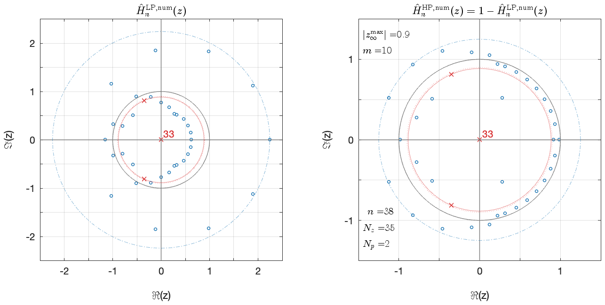
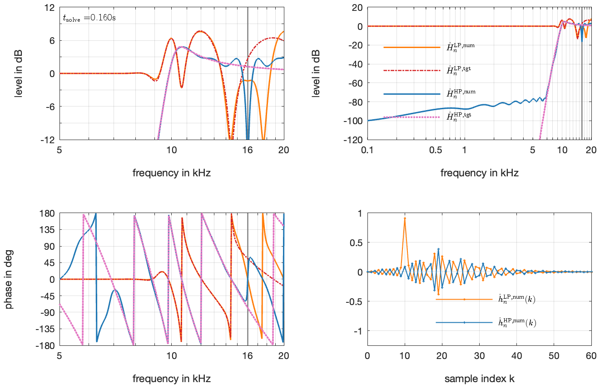

# fa2026_radial_iir_ls

## Paper
Frank Schultz, Nara Hahn, Sascha Spors (2026): "Discrete-time IIR filter design for radial filters by numerically optimised pole/zero placement." In: *Proc. of Forum Acusticum*, Graz, Austria, September 8-12, 2026. https://forum-acusticum.org/fa2026/

- [paper (pdf)](Schultz_2026_Dode_Radial_With_IIR_FIR_LS.pdf)
- [poster (pdf) TBD]()

## Abstract
For a certain mode in spherical wave field expansions, a radial filter characterises the radially dependent diffraction phenomenon due to a spherical obstacle.
Recently, the band-limited impulse invariance method (BLIIM) was proposed.
It allows a more precise design of discrete-time filters for improved numerical simulation of such diffraction phenomena.
However, for frequencies close to the Nyquist frequency and/or for high modal orders, BLIIM is numerically not straightforward or not feasible.
Then, one possible workaround is an optimisation-based infinite impulse response filter design with the continuous-time frequency response as target function, and solving for the coefficients of the $z$-domain transfer function.

An optimisation problem is exemplarily discussed for the radial filter occurring in the velocity-to-pressure spherical exterior expansion.
This highpass-shaped radial filter exhibits a steep slope and a rippled pass band for a high modal order.
The numerical experiments show that precise magnitude and phase responses of such radial filters can be achieved, requiring only some informed heuristics for the filter design parameters.
The approach can be used where BLIIM is not feasible.

## Theory in Short

For the $n$-th spherical mode, the highpass frequency response

$$H^{HP}_n(\omega,r,R) = -\mathrm{j} \cdot \frac{r}{R} \cdot \frac{h_n^{(2)}(\frac{\omega}{c}r)}{h_n^{'(2)}(\frac{\omega}{c}R)} \cdot \text{e}^{\text{+j} \frac{\omega}{c} (r-R)}$$

is the minimum-phase, amplitude-normalised version of the $n$-th order radial filter being involved in spherical, exterior wave field expansions from velocity to pressure. With spherical radiator (source) radius $R$ and freefield radius $r$, we hence assume $r>R$. Angular frequency $\omega$, speed of sound $c$, imaginary unit $\text{j}$, the $n$-th order spherical Hankel function $h^{(2)}_n(\cdot)$ of second kind and its derivative, and the time convention $\text{e}^{+\text{j} \omega t}$ are used. The latter implies that the `scipy.fft.fft()` is the transform from the temporal domain to the temporal-frequency domain, i.e. the quasi-standard engineering convention of the Fourier transforms.

The highpass filter has $n+1$ poles and $n+1$ zeros in the Laplace-domain.

If $n$ is very high, the digital filter design based on mapping Laplace-domain to z-domain is not straightforward due to numerical issues in robustely finding the (many) roots of the numerator and denominator polynomials of the Laplace transfer function. See older papers by Hahn, Schultz, Spors.

Thus, we here motivate a discrete-time filter design by numerical finding optimum pole / zero positions directly in the z-domain
- using the above given complex-valued frequency response directly as the target/desired frequency response, 
- employing a constraint for maximum allowed pole radius $\rho_\text{max}$
- defining the error as complex-valued frequency response between target and optimised, and
- solving for the least-squares error.

Essentially, to match the magnitude and phase of the highpass' narrow passband for high $n$ (it is close at the Nyquist frequency then), we do not neccesarily need $n+1$ poles in the discrete-time domain. The steep transition band slope of the highpass is realised by many zeros in discrete-time domain closely aligned around the unit circle in the transition and stop band regions. A short pre-delay (i.e. an FIR part) helps a lot to create the steep slope as the FIR part allows a pre-ringing in the impulse response.

## Filter Design Approach: Least-Squares IIR / FIR for Complex-Valued Frequency Response with User-Defineable Maximum-Allowed Pole Radius

We utilise the algorithm from M. Lang presented in:
- [Lan2000] Mathias C. Lang (2000): "**Least-Squares Design of IIR Filters with Prescribed Magnitude and Phase Responses and a Pole Radius Constraint.**" *IEEE Transactions on Signal Processing*, Volume **48**, Issue **11**, Pages 3109-3121. November 2000, https://doi.org/10.1109/78.875468
- [Lan1999] Mathias Lang (1999): "**Algorithms for the Constrained Design of Digital Filters with Arbitrary Magnitude and Phase Responses.**" doctoral thesis, TU Wien (University of Technology in Vienna, Austria), thesis is downloadable at https://mattsdsp.blogspot.com/p/phd-thesis.html

A Matlab reference code is given in Lang's thesis [Lan1999] and comprises the five dedicated functions
- `mpiir_l2()` (main solver function)
- `update()` (helper to solve quadratic program subproblem)
- `locmax()` (helper to find local maxima in discrete data)
- `lslevin()` (FIR filter designer for initial solution)
- `levin()` (helper for FIR filter, cf. `solve_toeplitz` of scipy.linalg)

We manually ported the functionality of these five functions to Python.
The Python code can be found in `util.py` in this repository. 

- Some of the examples given in [Lan1999] are validated / verified with `unit_test_python_port_lang_examples.py`.
- A unit test case with a filter that exhibits known digital poles / zeros is evaluated in `unit_test_python_port.py`. 
- The filters from the actual Forum Acusticum paper are designed and checked with `radial_filter_design.py` (note that the graphics in the paper are rendered with the Matlab filters, we were too lazy to prepare nice camera ready plots in Python as well).

The Matlab reference code and our Python port yield highly comparable results for all these filters. Due to involved different numerical linear algebra packages and numerical optimisation solvers in the Matlab vs. Python worlds, we should not expect bit-by-bit accuracy.

# Filter Example IV: Numerical IIR Highpass Filter Design with mpiir_l2()

## Filter Parameters

- `c = 343` m/s, speed of sound
- `fs = 32000` Hz, sampling frequency
- `R = 0.2` m, radius of spherical radiator / source  
- `r = 100 / fs * c + R` = 1.271875 m, freefield radius
- `n = 38`, spherical mode -> 6(n+1) dB/octave highpass stopband slope, which merges to a 6dB/octave slope towards DC.  
- `Preringing_Delay = 10`, samples, note: the complementary lowpass has its impulse response peak exactly at this pre-ringing delay value, cf. Fig. 4(b) right, bottom, orange
- `Np = 2`, number of non-origin poles to be optimised, note: highpass passband is comparably small, hence only few poles are needed
- `Nz = 35`, number of non-origin zeros to be optimised, note: we need some to achieve the steep highpass slope, reasonable rule of thumb: Nz in the range of n...n + Preringing_Delay
- `max_pole_radius = 0.9`, user-defineable constraint, must be >0 and <1
- frequency dependent error weighting: f<8000 Hz: 5000, f>8000 Hz: 1
- log spaced frequency vector with 512 frequencies from 1 Hz to fs/2

## Graphical Results

These correspond to Fig. 4 in the paper.

### Python All-in-one Plot

*Frequency & impulse response and z-plane for highpass of example IV, cf. Figure 4 in the paper. Results of the Python code, see `radial_filter_design.py` and `util.py`.*

### Matlab Split Plot

*z-planes for example IV, cf. Figure 4(a) in the paper. Results of the Matlab reference code. This graphic appears in the paper.*

*Frequency & impulse responses for example IV, cf. Figure 4(b) in the paper. Results of the Matlab reference code. This graphic appears in the paper.*

## Numerical Results

Different solvers (and even CPU architectures) might solve differently. Larger deviations especially occur if a high number of poles is to be optimised, as then the solver seriously gets work to do.

For programming we used a Mac Book Pro with M1 Pro Chip and Mac OS 26.5.1. We re-checked on several Windows and Linux machines, equipped with Intel and AMD CPUs.

### Python:
    - Python 3.13.7
    - numpy ver: 2.4.6
    - scipy ver: 1.17.1
    - qpsolvers ver: 4.12.0
    - quadprog ver: 0.1.13
    - cvxopt ver: 1.3.3
    - Blas & Lapack: Apple's Accelerate @ Mac OS 26.5.1, Apple M1 Pro
    - see script `radial_filter_design.py` in this repository

### Matlab
    - 23.2.0.3097123 (R2023b) Update 11
    - Operating System: macOS, Version: 26.5.1, Build: 25F80 
    - OpenBLAS 0.3.21
    - NAG Performance Components (NPC) Release 1.2.0, supporting Linear Algebra PACKage (LAPACK 3.9.1)

### Numerical Difference  

See calculation for `e_atol` and `e_rtol` in `radial_filter_design.py`.

        # Matlab vs. Python
        # coef b min/max e_atol: -1.7913509564593255e-10 1.7150947329014343e-10
        # coef b min/max e_rtol: -1.8402969814701464e-08 9.399681477617605e-09
        # coef a min/max e_atol: 0.0 7.622049658095875e-10
        # coef a min/max e_rtol: -1.0984089193755153e-09 0.0

Inherently to optimisation tasks, other filters might exhibit higher (or even lower) errors. Hence, we always use the (optimisation) algorithms with great care, and we always thoroughly check if & why the obtained results meet the intended requirements.
